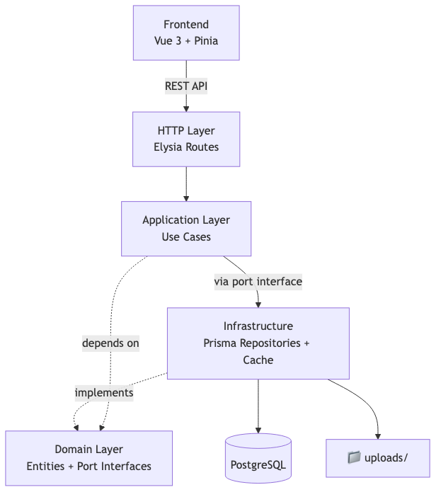
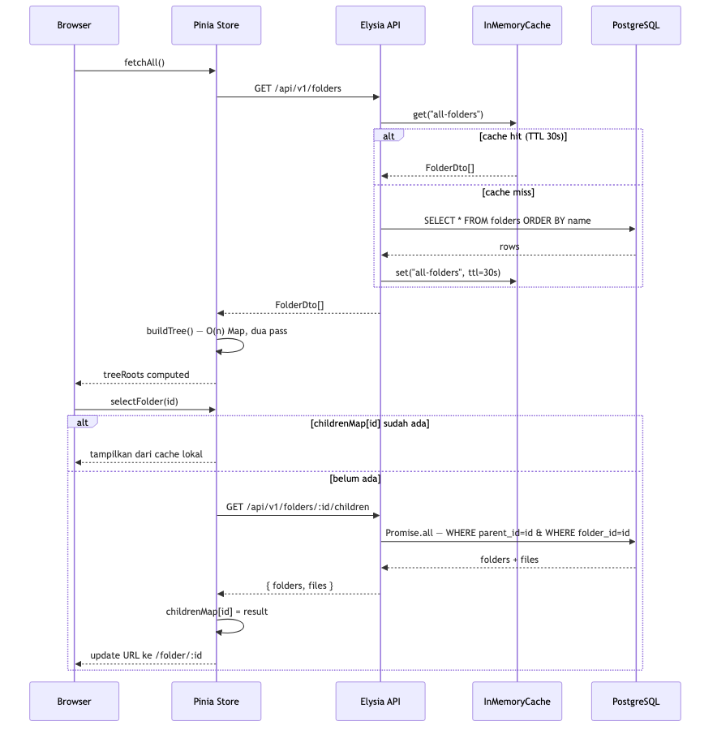
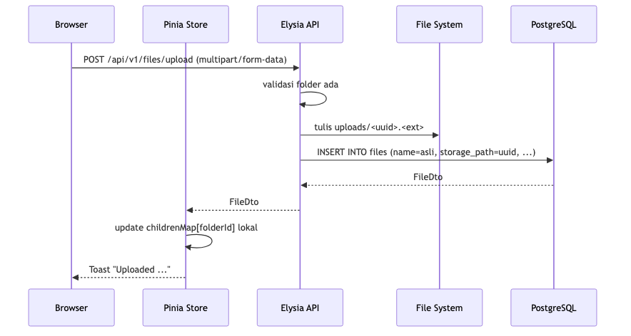
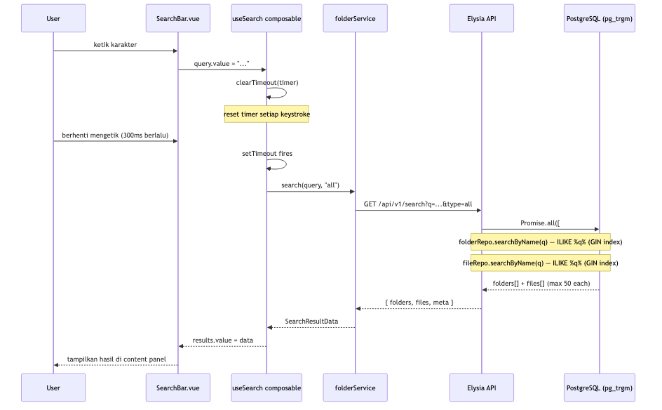
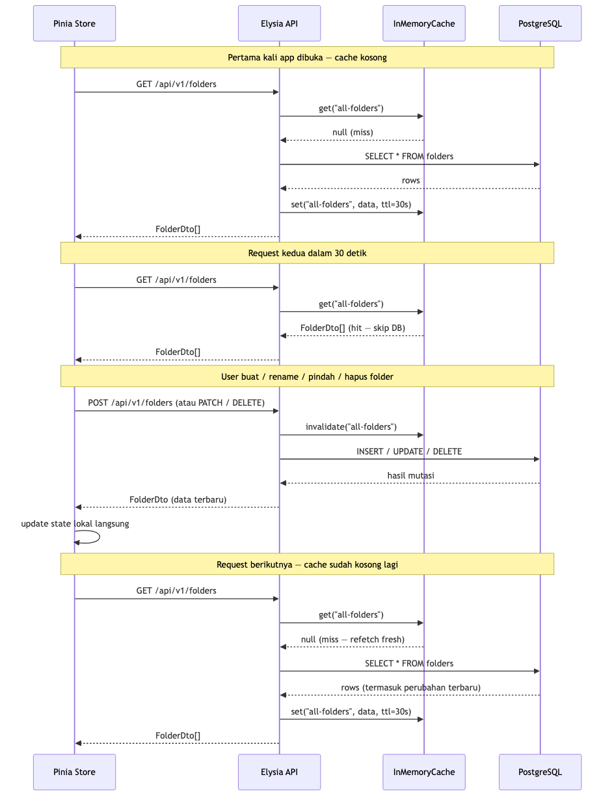

# Windows Explorer — Web Edition

Reimplementasi Windows Explorer di browser — split-panel UI, folder tree dengan virtual scroll, drag & drop, pencarian as-you-type, dan halaman dedicated per file.

Dibuat sebagai studi kasus arsitektur: hexagonal backend (Bun + Elysia + Prisma) dengan Vue 3 SPA di frontend yang tidak bergantung library tree eksternal.


---

## Apa yang bisa dilakukan

- Buat, rename, pindah, dan hapus folder — hapus folder akan cascade ke seluruh isinya
- Upload file ke folder aktif, lalu rename, salin, pindah, atau hapus
- Klik kanan untuk context menu, atau pakai keyboard: `Ctrl+A`, `Del`, `Escape`
- Multi-select dengan Ctrl+click dan Shift+click, drag & drop ke folder lain
- Cari file dan folder (debounce 300ms, case-insensitive, cukup ketik saja)
- Setiap folder dan file punya URL sendiri yang bisa dibagikan langsung
- Dark mode tersedia, view mode bisa diganti antara icons dan details

---

## Stack

| Layer | Teknologi |
|---|---|
| Runtime | Bun |
| HTTP Framework | Elysia |
| ORM | Prisma |
| Database | PostgreSQL 16 |
| Frontend | Vue 3 (Composition API) |
| State management | Pinia |
| Unit test (BE) | Bun test |
| Unit test (FE) | Vitest + Vue Test Utils |
| E2E test | Playwright |

---

## Gambaran Sistem



> Domain layer tidak tahu apa-apa tentang Elysia, Prisma, atau PostgreSQL.
> Application layer hanya bicara lewat port interface — implementasinya bisa diganti tanpa menyentuh use case.

---

## Arsitektur Backend

Backend mengikuti pola **Hexagonal Architecture** (Ports & Adapters) — tiga layer yang tidak saling bergantung kecuali lewat interface:

```
src/
├── domain/           # Entity dan port interface. Tidak ada import framework sama sekali.
│   ├── entities/     # Folder, File — plain TypeScript object
│   └── ports/        # IFolderRepository, IFileRepository, ICache<T>
│
├── application/      # Use case. Hanya bergantung ke port interface, bukan implementasi.
│   ├── use-cases/    # GetFolderTree, GetFolderChildren, SearchItems, MutateFolder, MutateFile
│   ├── dtos/         # FolderDto, FileDto — batas antara layer
│   └── errors/       # AppError — typed error dengan kode spesifik
│
└── infrastructure/   # Semua yang "kotor": framework, database, network.
    ├── http/          # Elysia routes, error handler middleware
    ├── repositories/  # PrismaFolderRepository, PrismaFileRepository
    └── cache/         # InMemoryCache<T>
```

Artinya use case bisa diuji unit tanpa menyentuh database — cukup inject mock yang implement `IFolderRepository`.

### Komponen backend satu per satu

**Domain entities** — `Folder` dan `File` adalah plain TypeScript interface, tidak ada method, tidak ada decorator, tidak ada ORM dependency.

**Port interfaces** — `IFolderRepository` mendefinisikan kontrak: `findAll`, `findById`, `findChildren`, `searchByName`, `create`, `rename`, `move`, `delete`. Implementasi bisa diganti (misal: dari Prisma ke raw SQL) tanpa menyentuh use case.

**Use cases** — masing-masing punya satu tanggung jawab:
- `GetFolderTree` — ambil semua folder flat, cek cache dulu, TTL 30 detik
- `GetFolderChildren` — ambil subfolder + file langsung dalam satu folder sekaligus
- `SearchItems` — jalankan `Promise.all` ke folder dan file repository secara paralel
- `MutateFolder` — create/rename/move/delete, selalu invalidate cache setelahnya
- `MutateFile` — create/rename/move/delete/copy, plus upload ke disk dengan UUID filename

**InMemoryCache** — implementasi `ICache<T>` dengan `Map` internal dan TTL per-entry. Bisa diganti Redis tanpa mengubah `GetFolderTree` sama sekali.

**Routes** — Elysia dengan schema validation bawaan (`t.Object`, `t.String`). UUID divalidasi di level route, bukan di use case.

**File serving** — `GET /uploads/:filename` melayani file yang sudah diupload dengan MIME type yang tepat dan `Cache-Control: public, max-age=3600`.

---

## Arsitektur Frontend

Vue 3 SPA dengan Composition API dan Pinia. Tidak ada library tree eksternal — semua dibangun dari scratch dengan pertimbangan performa.

```
src/
├── views/
│   ├── ExplorerView.vue    # Shell utama: sidebar + content panel, semua state terpusat di sini
│   └── FileView.vue        # Halaman per-file: video/audio/image player atau download
│
├── components/
│   ├── FolderTree.vue      # Sidebar tree — delegasi render ke virtual scroll
│   ├── FolderNode.vue      # Satu baris folder di tree
│   ├── ContentPanel.vue    # Area konten kanan — grid atau list
│   ├── FolderGrid.vue      # Render folder di content panel
│   ├── FileGrid.vue        # Render file di content panel
│   ├── BreadcrumbBar.vue   # Path navigasi
│   ├── SearchBar.vue       # Input pencarian
│   ├── ContextMenu.vue     # Menu klik kanan
│   ├── MoveToModal.vue     # Tree picker untuk pindah item
│   ├── PropertiesModal.vue # Metadata file/folder
│   ├── InputDialog.vue     # Pengganti window.prompt
│   └── Toast.vue           # Notifikasi non-blocking
│
├── stores/
│   └── folderStore.ts      # Satu-satunya source of truth: folders, childrenMap, selectedFolderId
│
├── services/
│   └── folderService.ts    # Semua HTTP call ke backend, tidak ada logic di sini
│
├── composables/
│   ├── useFolderTree.ts    # buildTree() + useFolderTree() — O(n) Map, open/close state
│   ├── useVirtualScroll.ts # Hitung slice yang terlihat berdasarkan scrollTop dan containerHeight
│   ├── useSearch.ts        # Debounce 300ms, cancel timer setiap keystroke
│   ├── useDragDrop.ts      # Shared state drag items (ref global)
│   ├── useTheme.ts         # Dark/light mode, persist ke localStorage
│   └── useToast.ts         # Toast queue
│
├── router/
│   └── index.ts            # /, /folder/:folderId, /file/:fileId
│
└── types/
    └── folder.ts           # FolderDto, FileDto, TreeNode, FlatNode, SearchResultData
```

### Tiga hal yang menarik di frontend

**O(n) tree build** — `buildTree()` di `useFolderTree.ts` melakukan dua pass: satu untuk isi Map `id → TreeNode`, satu lagi untuk pasang parent-child. Tidak ada rekursi, tidak ada `find()` berulang. Backend kirim flat array, frontend yang bangun struktur pohonnya.

**Virtual scroll** — `FolderTree` tidak render semua node sekaligus. `useVirtualScroll` hitung `start` dan `end` index dari `scrollTop` dan `containerHeight`, lalu render hanya slice itu dengan posisi absolut. DOM tetap di angka sekitar viewport ÷ 28px, tidak peduli berapa ribu folder yang ada.

**State management** — `folderStore` pakai `childrenMap` sebagai cache client-side: children baru di-fetch saat folder pertama kali dibuka, request berikutnya langsung ambil dari cache. Setiap mutasi update state lokal langsung tanpa re-fetch tree, kecuali `moveFolder` yang harus re-fetch karena struktur tree berubah.

---

## Database

Dua tabel dengan **adjacency list** — folder menyimpan `parent_id` yang menunjuk ke folder parent-nya.

```sql
-- Folder: self-referencing dengan cascade delete
folders (
  id         UUID PRIMARY KEY DEFAULT gen_random_uuid(),
  name       VARCHAR(255),
  parent_id  UUID REFERENCES folders(id) ON DELETE CASCADE,
  created_at TIMESTAMPTZ,
  updated_at TIMESTAMPTZ
)

-- File: selalu punya folder parent
files (
  id           UUID PRIMARY KEY DEFAULT gen_random_uuid(),
  name         VARCHAR(255),
  folder_id    UUID REFERENCES folders(id) ON DELETE CASCADE,
  mime_type    VARCHAR(100),
  size         BIGINT DEFAULT 0,
  storage_path VARCHAR(500),  -- nama file di disk (UUID-based)
  created_at   TIMESTAMPTZ,
  updated_at   TIMESTAMPTZ
)
```

Index yang ada: `folders(parent_id)`, `files(folder_id)`, dan GIN index `pg_trgm` untuk pencarian ILIKE case-insensitive yang tetap cepat di jumlah data besar.

`storage_path` menyimpan nama UUID di disk (`<uuid>.<ext>`), nama aslinya tetap di kolom `name`. Jadi rename file tidak perlu menyentuh filesystem sama sekali.

Hapus folder otomatis cascade ke subfolder dan file di dalamnya — ditangani PostgreSQL, bukan di application code.

---

## Flow Lengkap

**User buka folder → klik folder di tree → content panel update**



**User upload file**



**User ketik di search bar**



**Cache lifecycle — sebelum dan sesudah mutasi folder**



---

## API

| Method | Path | Keterangan |
|---|---|---|
| `GET` | `/api/v1/folders` | Semua folder dalam flat array |
| `GET` | `/api/v1/folders/:id/children` | Subfolder dan file langsung dalam folder |
| `POST` | `/api/v1/folders` | Buat folder baru |
| `PATCH` | `/api/v1/folders/:id` | Rename atau pindah folder |
| `DELETE` | `/api/v1/folders/:id` | Hapus folder beserta seluruh isinya |
| `GET` | `/api/v1/files/:id` | Ambil metadata satu file |
| `POST` | `/api/v1/files/upload` | Upload file (multipart/form-data) |
| `POST` | `/api/v1/files/:id/copy` | Salin file ke folder lain |
| `PATCH` | `/api/v1/files/:id` | Rename atau pindah file |
| `DELETE` | `/api/v1/files/:id` | Hapus file |
| `GET` | `/api/v1/search?q=&type=` | Cari file dan folder (`type`: `all` \| `folders` \| `files`) |
| `GET` | `/uploads/:filename` | Serve file yang sudah diupload |
| `GET` | `/health` | Health check |

---

## Menjalankan Lokal

**Yang dibutuhkan:** Bun ≥ 1.1, Docker (atau Podman)

```bash
# 1. Clone dan install
git clone <repo-url>
cd windows-explorer-app
bun install

# 2. Jalankan database
docker compose up -d

# 3. Setup environment backend
cp apps/backend/.env.example apps/backend/.env

# 4. Migrasi dan seed
cd apps/backend
bun run db:migrate
bun run db:seed

# 5. Jalankan (dua terminal)
bun run dev   # backend  → http://localhost:3001
              # frontend → http://localhost:5173
```

Buka **http://localhost:5173**.

---

## Testing

```bash
# Unit test backend
cd apps/backend && bun test tests/unit

# Integration test backend (butuh test DB jalan dulu)
docker compose -f docker-compose.test.yml up -d
bun run test:integration

# Unit test frontend
cd apps/frontend && bun run test

# E2E — backend dan frontend harus jalan
bun run test:e2e
```
